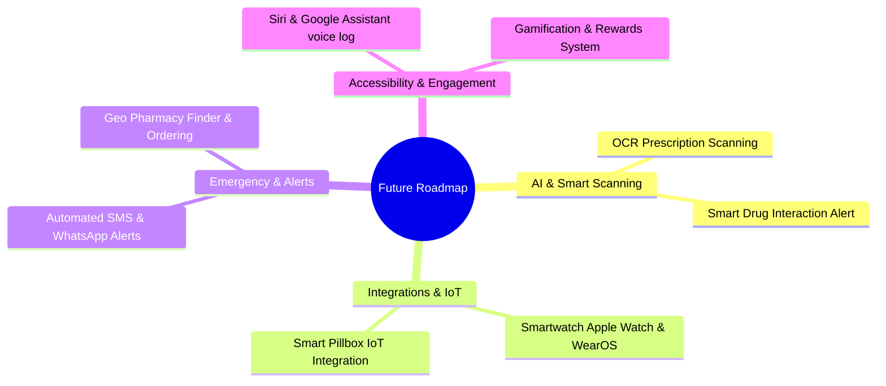

# Medicine Reminder Mobile App — Advanced Future Roadmap & Extensions

To make your graduation project, university thesis, or product documentation stand out and look extremely professional, this document outlines an **Advanced Future Roadmap**. It showcases the strategic vision of the product, outlining high-impact, state-of-the-art features that can be integrated to transition this Minimum Viable Product (MVP) into an enterprise-grade, AI-driven healthcare system.

## Roadmap Overview 

---

## 1. Artificial Intelligence & Smart Diagnostics 

### A. AI-Powered Prescription Scanning (OCR) 
* **Concept**: Instead of forcing patients (especially elderly users) to type long scientific names and complex schedules manually, they can simply capture a photo of the printed prescription (الروشتة).
* **Technical Implementation**:
  - Integrate **Google Cloud Vision API** or **ML Kit On-Device Text Recognition**.
  - Apply Natural Language Processing (NLP) models (e.g., GPT-based parser) to extract:
    1. **Medicine Name** (commercial and scientific).
    2. **Dosage** (e.g., 500mg, 1 tablet).
    3. **Frequency & Timing** (e.g., Twice daily, after meals).
  - Automatically pre-populate the medication form for user confirmation.

### B. Smart Drug-to-Drug Interaction Alerts 
* **Concept**: Medical safety is paramount. If a patient is prescribed two drugs that react negatively with each other, the app must warn them instantly.
* **Technical Implementation**:
  - Integrate with open medical database APIs like **RxNav API** or **WebMD Drug Interaction Checker**.
  - When the user adds a new medication, cross-reference its scientific ingredients with all active medications in their profile.
  - If a collision is detected (e.g., taking Aspirin with Warfarin increases bleeding risks), display an interactive warning modal categorizing the severity (**Mild**, **Moderate**, **Severe**) and advising doctor consultation.

## 2. IoT & Hardware Integrations 

### A. Smart Watch & Wearables Companion 
* **Concept**: Alarms should ring seamlessly on the user's wrist. This increases adherence drastically as users don't always have their phones in hand.
* **Technical Implementation**:
  - Develop lightweight watchOS and WearOS companion interfaces using **React Native Watch Connectivity**.
  - Synchronize alarms so they ring concurrently on the watch.
  - Enable quick actionable inputs from the watch interface: **[Mark Taken]** or **[Snooze 10m]** without needing to pull out the phone.

### B. IoT Smart Pillbox Integration 
* **Concept**: Linking the software reminder system with a physical, hardware-enabled pill container.
* **Technical Implementation**:
  - Connect a smart pill dispenser (using ESP32 or Raspberry Pi equipped with weight/infrared sensors and Bluetooth Low Energy - BLE).
  - The mobile app syncs reminder schedules with the physical box via BLE.
  - When it's time for a pill, the specific compartment in the physical box lights up.
  - If the compartment is opened and the weight decreases, the app automatically marks the dose as "Taken" without user manual input. If it remains closed, it triggers loud warnings.

## 3. Emergency Support & Remote Care 

### A. Automatic Caregiver Fallback Alerts (SMS / WhatsApp) 
* **Concept**: If a high-risk patient misses critical medication (e.g., heart pills) for more than 1 or 2 hours, they might be in danger. The system must notify their caregiver immediately.
* **Technical Implementation**:
  - Integrate **Twilio SMS API** or **WhatsApp Business API (BullMQ queue workers)** on the backend.
  - Set a threshold (e.g., 90 minutes past scheduled time without action).
  - Trigger an automated background event that sends a SMS or WhatsApp message to the caregiver's registered phone number:
    `"⚠️ Alert: [Patient Name] has missed their critical dose of [Medicine Name] scheduled at [Time]. Please check on them."`

### B. Geolocation-Based Refills & Order Integration 
* **Concept**: When pill stocks run low, the app shouldn't just alert the user; it should help them buy the refill.
* **Technical Implementation**:
  - Use **Google Maps Places API** to identify and map the nearest 24/7 pharmacies based on GPS location.
  - Provide direct API integration with popular local online pharmacy delivery systems (such as Yodawy, Vezeeta, or local pharmacy chains) to add the medicine to a shopping cart with one click.

## 4. Accessibility & Dynamic Engagement 

### A. Voice-Activated Logging (Siri & Google Assistant) 
* **Concept**: Perfect for visually impaired users or during activities. Users can manage their medications using voice commands.
* **Technical Implementation**:
  - Configure **Siri Shortcuts (iOS)** and **Google Assistant App Actions (Android)**.
  - Support natural language phrases:
    - *"Did I take my morning medicine?"* -> App reads out today's taken state.
    - *"Log my Aspirin as taken."* -> App performs backend POST request and plays confirmation speech.

### B. Gamification & Reward Systems 
* **Concept**: Combating clinical neglect with positive reinforcement. Patients are rewarded for consistent adherence.
* **Technical Implementation**:
  - Develop a "Habit Streak" counter inside the frontend.
  - Award "Adherence Points" and achievement badges (e.g., **"7-Day Perfect Streak"**, **"Compliance Champion"**).
  - Partnerships can be made so that these points translate into actual financial discount codes redeemable at partnered pharmacies or health insurance providers.

---

## Summary of Impact on University Projects 

Listing a futuristic vision in your graduation document demonstrates a mature understanding of system architecture. Under the section **"Future Work"** of your thesis, these points show the jury that:
1. **Scalability**: Your backend API and database schemas are flexible enough to accommodate smart IoT endpoints, AI scanning integrations, and external REST services.
2. **Clinical Safety**: You recognize that healthcare software requires fail-safes (caregiver alert fallbacks, drug interaction checks) to protect lives.
3. **Accessibility**: You prioritize inclusive UI designs that cater to the elderly and visually impaired.
