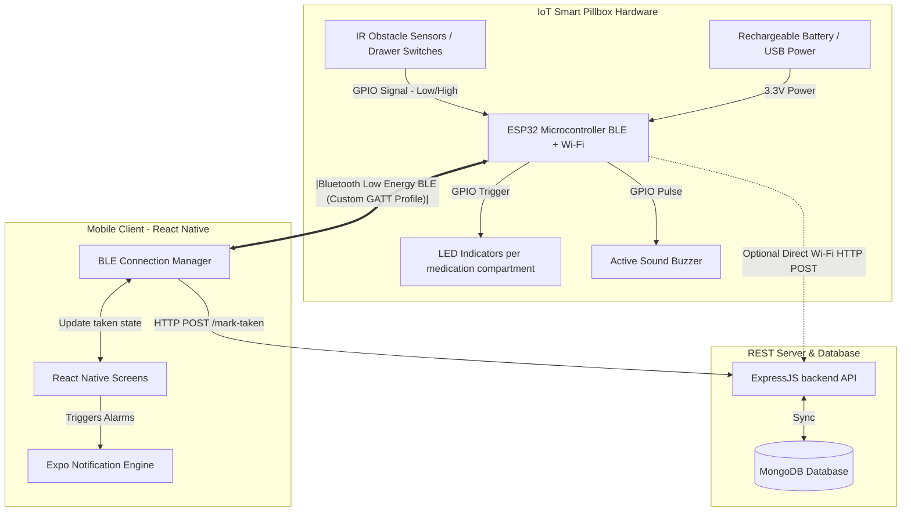

# Medicine Reminder App — IoT Smart Pillbox Integration Guide

Integrating physical hardware (Embedded Systems & IoT) with your mobile application is a powerful upgrade that elevates a graduation project from a simple software application to a **cyber-physical healthcare solution**. 

This document serves as a complete technical guide, providing the system architecture, hardware bill of materials, circuit connections, and sample code (both C++ Arduino for ESP32 and React Native BLE) to build a **Smart Pillbox **.


## 1. System Architecture Diagram 



---

## 2. Hardware Bill of Materials (BOM) 

To build a prototype of a **3-Compartment Smart Pillbox**, you will need the following components:

| Component (المكون) | Purpose (الغرض منه) | Est. Cost (السعر التقريبي) |
| :--- | :--- | :--- |
| **ESP32 NodeMCU Board** | The brain of the system, supporting Bluetooth BLE and Wi-Fi. | \$5 - \$7 |
| **IR Obstacle Sensors (x3)** | Mounted in each drawer/slot to detect if a pill is present or drawer is opened. | \$3 |
| **WS2812B Addressable LED Strip** | Individually lights up specific slots (e.g. Slot 1 = Red, Slot 2 = Green). | \$3 |
| **Active Buzzer (5V)** | Sounds an audible alarm when a pill time is reached. | \$0.50 |
| **Breadboard & Jumper Wires** | To connect the circuit together without soldering. | \$2 |
| **Li-Po Battery (3.7V) + TP4056 Charger** | To make the pillbox fully portable. | \$4 |

---

## 3. Circuit Wiring & Schematic Connections 

| Component | Pin on Component | Pin on ESP32 | Connection Type |
| :--- | :--- | :--- | :--- |
| **Buzzer** | VCC (+)<br>GND (-)<br>I/O (Signal) | 3.3V<br>GND<br>**GPIO 25** | Digital Output (PWM) |
| **WS2812B LED Strip** | 5V (+)<br>GND (-)<br>DIN (Data) | VIN (5V)<br>GND<br>**GPIO 27** | Digital Addressable Output |
| **IR Sensor 1 (Slot 1)** | VCC / GND / OUT | 3.3V / GND / **GPIO 13** | Digital Input |
| **IR Sensor 2 (Slot 2)** | VCC / GND / OUT | 3.3V / GND / **GPIO 12** | Digital Input |
| **IR Sensor 3 (Slot 3)** | VCC / GND / OUT | 3.3V / GND / **GPIO 14** | Digital Input |

---

## 4. ESP32 Firmware Code (C++ / Arduino) 

This C++ sketch runs on the **ESP32**. It sets up a **Bluetooth BLE server** with a custom service and characteristics. When an alarm time is reached, the mobile app sends a BLE command to light up a specific slot and sound the buzzer. When the patient opens the drawer (detected by the IR sensor), the buzzer stops and the ESP32 sends a "Taken" callback to the phone.

```cpp
#include <Arduino.h>
#include <BLEDevice.h>
#include <BLEUtils.h>
#include <BLEServer.h>
#include <Adafruit_NeoPixel.h>

// Custom BLE UUIDs (Generate unique UUIDs for GATT service)
#define SERVICE_UUID        "4fafc201-1fb5-459e-8fcc-c5c9c331914b"
#define ALARM_CHAR_UUID     "beb5483e-36e1-4688-b7f5-ea07361b26a8" // Write to trigger alarm
#define STATUS_CHAR_UUID    "e3223119-9445-4e7d-875c-ee798b3f114c" // Read/Notify taken state

// Pins Configuration
#define BUZZER_PIN 25
#define LED_PIN    27
#define NUM_LEDS   3 // 3 medication slots

#define IR_PIN_1   13
#define IR_PIN_2   12
#define IR_PIN_3   14

Adafruit_NeoPixel strip(NUM_LEDS, LED_PIN, NEO_GRB + NEO_KHZ800);
BLECharacteristic* pStatusCharacteristic;
bool deviceConnected = false;

int activeAlarmSlot = -1; // -1 means no active alarm
bool isAlarmActive = false;

// BLE Callbacks
class MyServerCallbacks: public BLEServerCallbacks {
    void onConnect(BLEServer* pServer) {
      deviceConnected = true;
      Serial.println("📱 Mobile app connected via BLE");
    }
    void onDisconnect(BLEServer* pServer) {
      deviceConnected = false;
      Serial.println("📱 Mobile app disconnected");
      BLEDevice::startAdvertising(); // Restart advertising
    }
};

class AlarmCallbacks: public BLECharacteristicCallbacks {
    void onWrite(BLECharacteristic *pCharacteristic) {
      std::string value = pCharacteristic->getValue();
      if (value.length() > 0) {
        int slot = value[0] - '0'; // Expecting ASCII '0', '1', '2'
        if (slot >= 0 && slot < NUM_LEDS) {
          activeAlarmSlot = slot;
          isAlarmActive = true;
          Serial.printf("⏰ Alarm triggered for Slot: %d\n", slot);
        } else if (value == "STOP") {
          isAlarmActive = false;
          activeAlarmSlot = -1;
          noTone(BUZZER_PIN);
          strip.clear();
          strip.show();
          Serial.println("⏰ Alarm manually stopped");
        }
      }
    }
};

void setup() {
  Serial.begin(115200);
  
  // Configure Pins
  pinMode(BUZZER_PIN, OUTPUT);
  pinMode(IR_PIN_1, INPUT_PULLUP);
  pinMode(IR_PIN_2, INPUT_PULLUP);
  pinMode(IR_PIN_3, INPUT_PULLUP);
  
  strip.begin();
  strip.show(); // Initialize all pixels to 'off'
  
  // Set up BLE
  BLEDevice::init("SmartPillbox_IoT");
  BLEServer *pServer = BLEDevice::createServer();
  pServer->setCallbacks(new MyServerCallbacks());
  
  BLEService *pService = pServer->createService(SERVICE_UUID);
  
  // Characteristic to write alarms
  BLECharacteristic *pAlarmCharacteristic = pService->createCharacteristic(
                                         ALARM_CHAR_UUID,
                                         BLECharacteristic::PROPERTY_WRITE
                                       );
  pAlarmCharacteristic->setCallbacks(new AlarmCallbacks());
  
  // Characteristic to notify mobile app about taken doses
  pStatusCharacteristic = pService->createCharacteristic(
                                         STATUS_CHAR_UUID,
                                         BLECharacteristic::PROPERTY_READ |
                                         BLECharacteristic::PROPERTY_NOTIFY
                                       );
                                       
  pService->start();
  
  // Start Advertising
  BLEAdvertising *pAdvertising = BLEDevice::getAdvertising();
  pAdvertising->addServiceUUID(SERVICE_UUID);
  pAdvertising->setScanResponse(true);
  pAdvertising->setMinPreferred(0x06);
  pAdvertising->setMinPreferred(0x12);
  BLEDevice::startAdvertising();
  Serial.println("📡 BLE Smart Pillbox is broadcasting... Ready to sync!");
}

void loop() {
  if (isAlarmActive && activeAlarmSlot != -1) {
    // Sound the buzzer (pulsing alarm)
    tone(BUZZER_PIN, 1000); 
    delay(300);
    noTone(BUZZER_PIN);
    delay(300);
    
    // Light up the corresponding slot LED (e.g. Red)
    strip.clear();
    strip.setPixelColor(activeAlarmSlot, strip.Color(255, 0, 0)); // Red alarm color
    strip.show();
    
    // Read the specific IR sensor to detect pillbox opening/pill removal
    int sensorVal = HIGH;
    if (activeAlarmSlot == 0) sensorVal = digitalRead(IR_PIN_1);
    else if (activeAlarmSlot == 1) sensorVal = digitalRead(IR_PIN_2);
    else if (activeAlarmSlot == 2) sensorVal = digitalRead(IR_PIN_3);
    
    // Assuming active-low IR sensor (LOW when drawer opened / pill removed)
    if (sensorVal == LOW) {
      Serial.printf("💊 Pill taken from Slot %d!\n", activeAlarmSlot);
      isAlarmActive = false;
      
      // Stop Buzzer and Clear LED
      noTone(BUZZER_PIN);
      strip.setPixelColor(activeAlarmSlot, strip.Color(0, 255, 0)); // Green for success
      strip.show();
      delay(2000);
      strip.clear();
      strip.show();
      
      // Notify mobile app via BLE GATT notification
      if (deviceConnected) {
        char msg[2] = {(char)(activeAlarmSlot + '0'), '\0'};
        pStatusCharacteristic->setValue(msg);
        pStatusCharacteristic->notify();
        Serial.println("📱 Sent taken status update to Mobile App");
      }
      
      activeAlarmSlot = -1;
    }
  }
}
```

---

## 5. Mobile BLE Integration Code (React Native) 

Using the library **`react-native-ble-plx`**, here is how the mobile application establishes connection with the **Smart Pillbox**, sends alarms, and receives "Taken" confirmations to sync instantly with the cloud server database:

```typescript
import React, { useEffect, useState } from 'react';
import { BleManager, Device } from 'react-native-ble-plx';
import { medicinesService } from '../src/services/medicinesService';

const manager = new BleManager();
const SERVICE_UUID = "4fafc201-1fb5-459e-8fcc-c5c9c331914b";
const ALARM_CHAR_UUID = "beb5483e-36e1-4688-b7f5-ea07361b26a8";
const STATUS_CHAR_UUID = "e3223119-9445-4e7d-875c-ee798b3f114c";

export function useSmartPillbox() {
  const [connectedDevice, setConnectedDevice] = useState<Device | null>(null);

  useEffect(() => {
    const subscription = manager.onStateChange((state) => {
      if (state === 'PoweredOn') {
        scanAndConnect();
      }
    }, true);
    return () => subscription.remove();
  }, []);

  // Scan and auto-connect to the Pillbox
  const scanAndConnect = () => {
    manager.startDeviceScan(null, null, (error, device) => {
      if (error) {
        console.log("BLE Scan Error:", error);
        return;
      }
      if (device?.name === 'SmartPillbox_IoT') {
        manager.stopDeviceScan();
        device.connect()
          .then((dev) => dev.discoverAllServicesAndCharacteristics())
          .then((dev) => {
            setConnectedDevice(dev);
            console.log("✅ Successfully connected to Smart Pillbox!");
            monitorPillboxStatus(dev);
          })
          .catch((err) => console.log("Connection failure:", err));
      }
    });
  };

  // Monitor status notifications sent by the Pillbox (Tells us when patient takes the medicine)
  const monitorPillboxStatus = (device: Device) => {
    device.monitorCharacteristicForService(SERVICE_UUID, STATUS_CHAR_UUID, async (error, char) => {
      if (error) {
        console.log("Monitor characteristic error:", error);
        return;
      }
      if (char?.value) {
        // Decode base64 value returned by BLE
        const decodedValue = Buffer.from(char.value, 'base64').toString('ascii');
        const slotId = parseInt(decodedValue);
        
        console.log(`💊 Slot ${slotId} was opened! Syncing dose as Taken...`);
        
        // Map slot index to active medicine in context
        // Example: Slot 0 = Panadol
        const activeMedicineId = await getMedicineIdMappedToSlot(slotId);
        if (activeMedicineId) {
          const now = new Date();
          const timeString = `${String(now.getHours()).padStart(2,'0')}:${String(now.getMinutes()).padStart(2,'0')}`;
          await medicinesService.markDoseTaken(activeMedicineId, timeString);
          console.log("✅ Successfully synced taken dose with Backend API!");
        }
      }
    });
  };

  // Send alarm trigger to ESP32 when reminder fires
  const triggerPillboxAlarm = async (slotId: number) => {
    if (!connectedDevice) return;
    const base64Data = Buffer.from(String(slotId)).toString('base64');
    await connectedDevice.writeCharacteristicWithResponseForService(
      SERVICE_UUID,
      ALARM_CHAR_UUID,
      base64Data
    );
    console.log(`📡 BLE command sent: Activate alarm for Slot ${slotId}`);
  };

  const getMedicineIdMappedToSlot = async (slotId: number): Promise<string | null> => {
    // Map slots based on configurations in application memory
    // Dummy logic example:
    const meds = await medicinesService.getAllMedicines();
    return meds[slotId]?._id || null;
  };

  return { connectedDevice, triggerPillboxAlarm };
}
```

---

## 6. How this Benefits Graduation & University Assessments

By explaining and attaching this hardware guide to your academic submission, you score points in multiple critical metrics:

1. **Cyber-Physical Systems (CPS)**: It shows a sophisticated synergy between hardware embedded systems (ESP32 microcontrollers in C++) and high-level mobile applications (React Native in TS).
2. **True IoT Implementation**: Proves you didn't just write a database; you designed a local mesh connection utilizing Bluetooth Low Energy (GATT protocol) to securely sync state factors offline.
3. **Accessibility Focus**: It directly showcases your attention to accessibility, enabling automated detection for patients who cannot physically interact with smartphone touchscreens easily.

