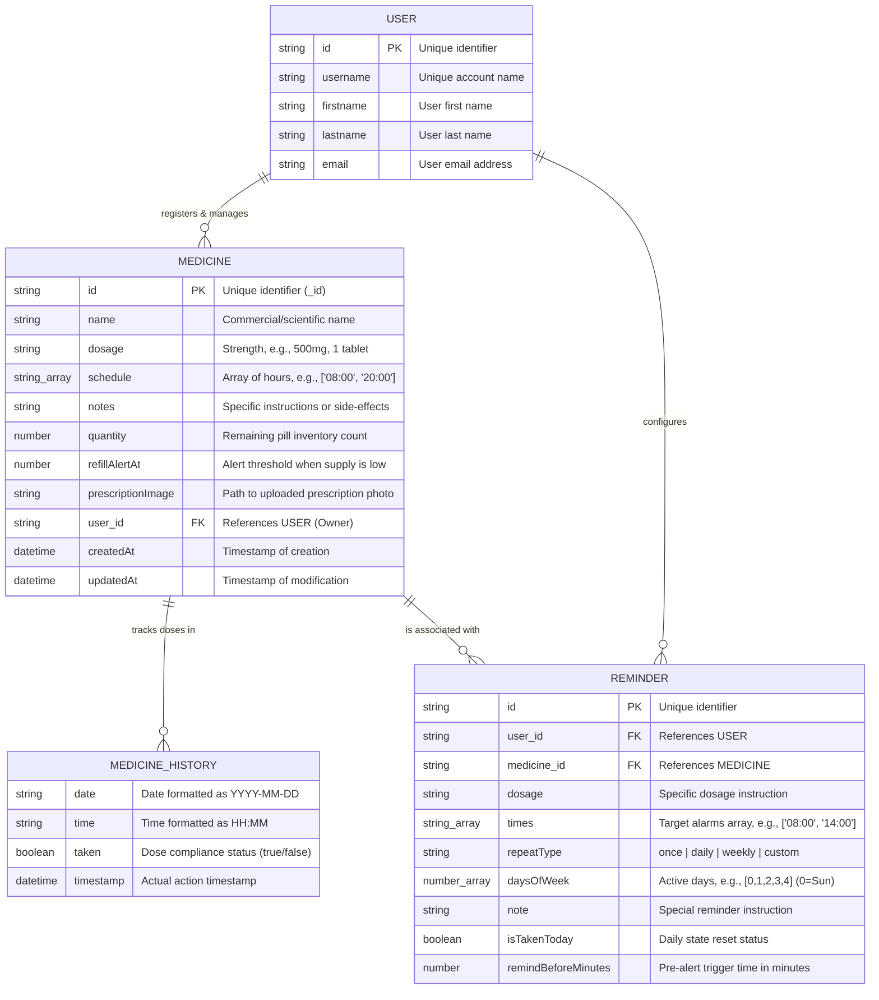
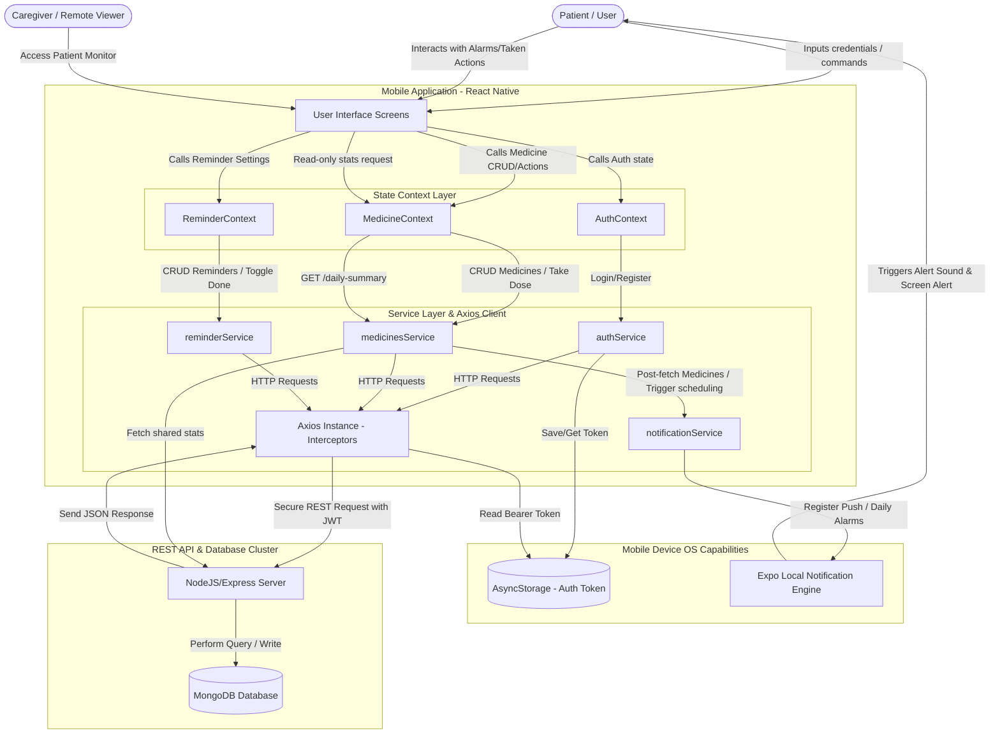

# Medicine Reminder Mobile App — Comprehensive System Documentation

Welcome to the official developer and system documentation for the **Medicine Reminder Mobile Application**. This document is prepared to serve as a comprehensive reference for your final university project, graduation thesis, or technical documentation folder. It details the system architecture, entity relationships, database structures, data flow dynamics, core business logic, and feature list of the mobile app.


## 1. System Architecture & Data Structure Diagram 

The mobile application is built using **React Native (Expo)** with **TypeScript** and **Expo Router** for modern, file-based routing. It communicates asynchronously with a **Node.js/Express** backend and stores user sessions locally using **AsyncStorage**.

### Data Structure Details (Mobile Models) 

The application relies on three core data entities: **User**, **Medicine**, and **Reminder**. The history of taken doses is embedded within the **Medicine** entity to ensure efficient schema structures.

#### Entity Relationship Diagram (ERD) 
Below is the structured relational schema representing the client-server data models.



---

## 2. Data Flow Diagram (DFD) 

The DFD models how data enters the application, how it is processed by the state contexts (`AuthContext`, `MedicineContext`, `ReminderContext`), saved in local phone mechanisms (such as **AsyncStorage** for JWT and **Expo Notifications** for alerts), and synchronized with the backend MongoDB database.

### Level 1 Data Flow Diagram 



---

## 3. Business Line & Core Logic

The mobile application relies on strict business rules to ensure high clinical safety, dose compliance, and excellent offline usability.

### A. Authentication & Session Security Flow 
* **Automatic Token Injection** : Using Axios interceptors, the system checks for `authToken` inside `AsyncStorage` and injects it automatically as `Bearer <token>` inside the request headers.
* **Token Expiration Guard** : If a `401 Unauthorized` response is returned by the API (indicating session expiry), the client app intercepts the error, clears the invalid token from `AsyncStorage`, resets state variables, and immediately redirects the user to the `/(auth)/sign-in` layout screen.
* **Navigation Guards ** : Expo Router segments are dynamically monitored. If the user is unauthenticated, they are blocked from accessing dashboard routes and automatically redirected to login. If they are already authenticated, they are prevented from seeing login/register forms and routed to `/home`.

### B. Smart Alarm & Reminder Logic
* **Local Offline Scheduling **: The app uses `expo-notifications` to schedule alarms directly inside the mobile operating system. This ensures alarms fire **even if there is no internet connection**.
* **Daily Recurrence Trigger **: For each time in `medicine.schedule[]` (e.g., `"08:00"`), the scheduling engine parses the hours and minutes and triggers a local notification with trigger type `DAILY` (`SchedulableTriggerInputTypes.DAILY`).
* **Snoozing Capabilities **: When a reminder rings, if the patient is unable to take the medication immediately, they can trigger a **Snooze (10 minutes)**. This schedules a single-use time-interval reminder (`TIME_INTERVAL`) to fire after exactly 600 seconds.
* **Intelligent Auto-Cleanup **: Every time a medicine is added, modified, or deleted:
  1. The app cancels all scheduled alarms associated with that specific `medicineId` via `Notifications.cancelScheduledNotificationAsync`.
  2. If edited, it recalculates and reschedules the new alarm schedules dynamically to prevent duplicate alerts.

### C. Inventory Control & Refill Warnings
* **Consumption Auto-Decrement **: When a patient marks a dose as "taken", the backend API decrements the medicine inventory by 1 pill (`quantity = quantity - 1`).
* **Refill Alerts Threshold **: If the remaining `quantity` drops below or matches the `refillAlertAt` threshold (e.g., 5 pills):
  - A persistent notification is immediately scheduled locally (`scheduleRefillAlert`) saying: `Medicine supply is low (X remaining)`.
  - If the quantity reaches `0`, the alert changes status dynamically to: `Medicine is OUT OF STOCK!` and highlights the medication card in red across all dashboards.

### D. Caregiver Shared Access System (Read-Only) 
* **Adherence Formula **: Patient compliance is calculated dynamically on the backend daily and fetched in the daily summary:
  $$\text{Adherence Rate (\%)} = \left( \frac{\text{Total Taken Doses Today}}{\text{Total Scheduled Doses Today}} \right) \times 100$$
* **Read-Only Dashboard **: Designed specifically for relatives or nurses. When logged in caregiver mode, the app renders a dark-slate theme layout with a read-only token restriction. All "take dose" buttons, edit forms, and delete operations are deactivated. The caregiver gets a real-time tracking panel displaying the patient's:
  - Adherence circular chart (`AdherenceRing` component).
  - List of currently active medications.
  - Hour-by-hour taken vs. missed status indicators for today's schedule.

---

## 4. Detailed Features Explanation 

Here is a list of all features, pages, and modular components integrated into the mobile app:

### 1. Authentication Screen (`/(auth)/auth.tsx`)
* Offers dual forms for Login (SignIn) and Registration (SignUp). Features field validation for password confirmation, secure entry visibility toggles, and handles storing authorization web tokens locally.

### 2. Main Dashboard Page (`/home.tsx`)
* The main control panel for patients. It displays a welcoming banner, a quick stats overview (adherence percentage ring, active pills count, taken count, missed count), and the chronological list of medicines to take today. It has a floating action button (FAB) to quickly add new medicines.

### 3. Medication Management Engine (`/medications`)
* **Add Medication Screen (`add.tsx`)**: Form to input name, dosage string, dosage notes, pill inventory counts, and set a custom refill alert threshold. It also allows multiple dosage times to be selected.
* **Medication Detail Screen (`[id].tsx`)**: Displays comprehensive details about the drug, inventory status, compliance history, and allows the user to upload or photograph their medical prescription.
* **Edit Medication Screen (`edit/[id].tsx`)**: Enables editing details, adding new times, or updating pill inventory counts when a refill is purchased.

### 4. Smart Reminders Scheduler (`/reminders`)
* Dedicated reminder planner. Patients can define complex repeating rules (once, daily, weekly on specific days, or custom intervals) and coordinate alarms prior to the target time.

### 5. Daily Summary compliance (`/daily-summary.tsx`)
* An analytical dashboard displaying today's progress. Renders interactive chart rings showing adherence rates, and break downs of doses categorized into "Taken" and "Missed".

### 6. Missed Doses Log Screen (`/missed-doses.tsx`)
* Displays a history log of all doses the patient skipped or missed to take within their designated scheduled times, helping doctors audit medical compliance.

### 7. Calendar View screen (`/calendar/index.tsx`)
* A comprehensive schedule calendar grid. The patient can select any date on the calendar, and the app displays the planned medication schedule and taken state for that specific day.

### 8. Caregiver Shared Access Panel (`/caregiver.tsx`)
* A custom dark-slate layout that serves as a read-only screen for caregivers, displaying live stats, medicine lists, and scheduled compliance without giving privileges to modify or delete patient setups.

---

## 5. API Integration Architecture 

The client application integrates services inside `src/services/` that map straight to Express backend controllers:

```
[Mobile Client Services] ─── (HTTP JSON / Multipart) ───> [REST Backend Controllers]
  ├── authService.ts          =======>  /api/auth/* (login, register, profile)
  ├── medicinesService.ts     =======>  /api/medicines/* (CRUD, mark-taken, refill-alerts, summary)
  └── reminderService.ts      =======>  /api/reminders/* (CRUD for detailed reminders, repeat types)
```


